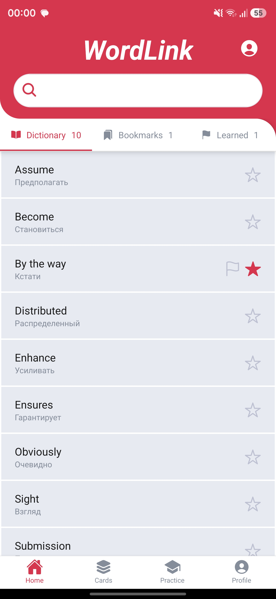
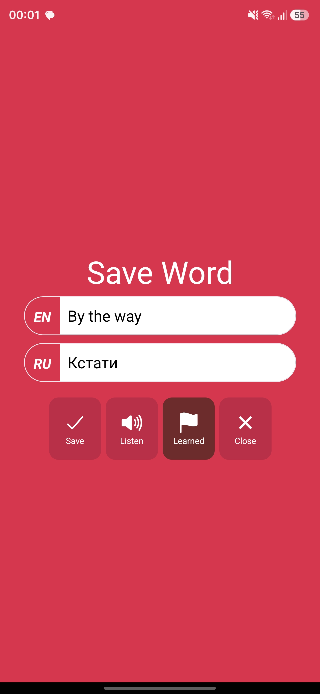
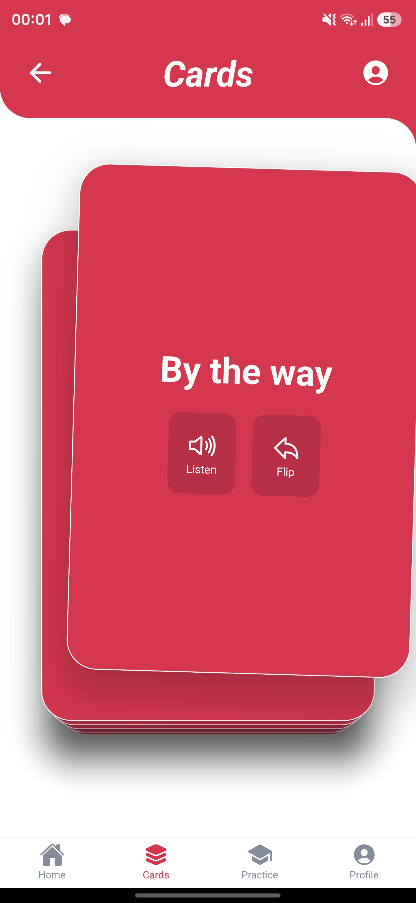
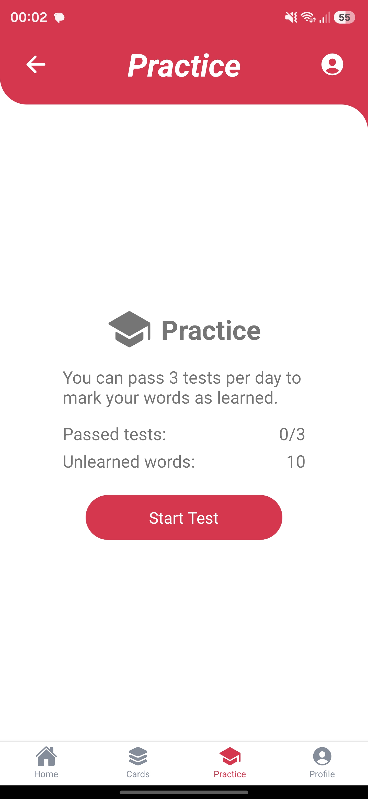

# WordLinkApp

A mobile app for learning vocabulary (dictionary, flashcards, practice).  
Supports offline mode and sync with the server when online.

> Related repositories:  
> - [WordLinkWeb](https://github.com/seredokhov/WordLinkWeb) — backend + admin panel  
> - [WordLinkApp](https://github.com/seredokhov/WordLinkApp) — React Native client

## Screenshots

| Home | Words | Cards | Practice |
| --- | --- | --- | --- |
|  |  |  |  |

## Features

- Login / registration
- Word dictionary with translations
- Favorites and learned words
- Flip cards
- Practice mode with results
- Offline storage (AsyncStorage)
- API sync when online
- Text-to-speech (TTS)
- Network status checks (NetInfo)

## Tech stack

- React Native
- React Navigation (stack / tabs)
- Context API + useReducer
- Axios
- AsyncStorage
- React Native TTS
- NetInfo

## Project structure

```text
src/
  components/   # UI components
  screens/      # Screens
  navigators/   # Navigation
  services/     # API, storage, TTS
  store/        # state (context + reducer)
  constants/    # theme, constants
  utils/        # helpers and hooks
```

## Getting started

### Requirements

- Node.js >= 18
- Android Studio / Xcode (for emulator or device)
- Running backend from [WordLinkWeb](https://github.com/seredokhov/WordLinkWeb) (if you need sync)

### Install

```bash
npm install
```

### Run

```bash
npm start
npm run android
```

> Before running, check the API base URL in the HTTP config/services (it may be hardcoded for local development).

## Status

Pet project.

## Author

Pavel Seredokhov
GitHub: [seredokhov](https://github.com/seredokhov)
